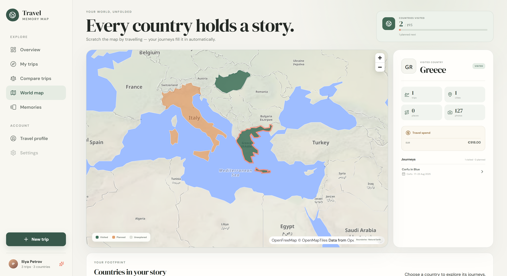
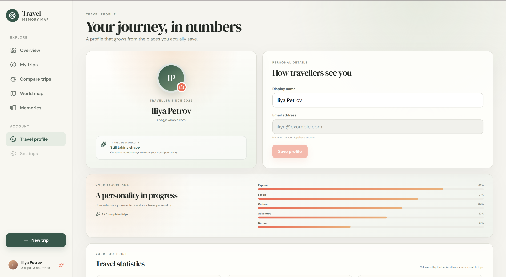
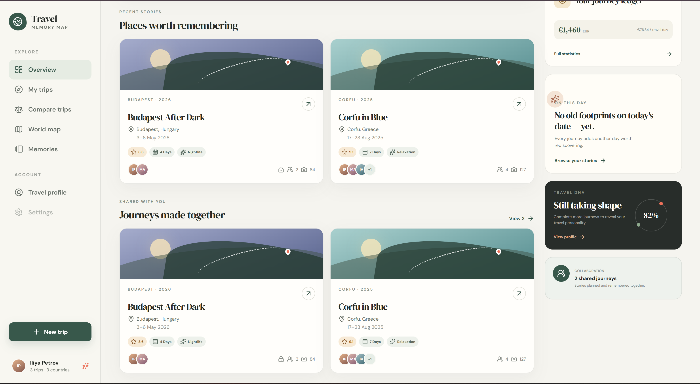

# Travel Memory Map

Travel Memory Map is a collaborative travel journal that turns a trip into an interactive story: route, timeline, memories, expenses and a replay on the map.

It is a production-shaped portfolio project that separates the frontend experience from authoritative backend permissions and keeps private collaboration distinct from public sharing.

## Preview

<p align="center">
  <a href="https://ilynet-0302.github.io/Travel-Memory-Map/">
    
  </a>
</p>

<p align="center">
  
  
</p>

<details>
  <summary><strong>More from the travel dashboard</strong></summary>
  <br>
  
</details>

<br>

<p align="center">
  <a href="https://ilynet-0302.github.io/Travel-Memory-Map/">
    
  </a>
  <a href="https://github.com/ilynet-0302/Travel-Memory-Map">
    
  </a>
</p>

The frontend is deployed through GitHub Pages, while the Spring Boot API runs on Render with Supabase providing PostgreSQL, authentication and private photo storage.

## Features

- responsive dashboard with realistic travel summaries;
- authenticated server-side search across trips, countries, cities, places and years;
- advanced trip filters for status, rating, price/currency, duration, Trip DNA and owner/shared relationship;
- create-trip flow with React Hook Form and Zod;
- editable authenticated travel profile with backend-derived trip statistics;
- owner trip editing, archiving and permanent deletion;
- owner/editor stop creation, editing and deletion;
- trip detail with a labelled OpenStreetMap-based MapLibre basemap, full route and markers;
- timeline generated from trip stops;
- interactive Trip Replay controls (play, pause, previous, next, 1×/2×/4×);
- TanStack Query API boundary and optional demo mode;
- member list, owner-controlled EDITOR / VIEWER role management and leave flow;
- secure invitation creation, anonymous preview, authenticated acceptance and revocation;
- invite expiry, maximum-use enforcement, duplicate-member protection and row locking;
- private Supabase Storage photo gallery with upload, signed previews and deletion;
- JPEG/PNG/WebP validation, 10 MB limits, EXIF time/GPS extraction and stop association;
- photo counts in trips and backend-derived profile statistics;
- shared expenses with participant splits, category/currency summaries and deterministic settlements;
- multi-category trip ratings, return intent and aggregate rating summaries;
- deterministic Trip DNA, travel personality, statistics and trip comparison;
- memory gallery, On This Day memories and an interactive world scratch map;
- curated public trip pages with explicitly selected public photos;
- Spring Boot API for trips, search, stops, members, invitations, photos, expenses, ratings, replay and public sharing;
- Supabase JWT verification through Spring Security Resource Server;
- centralized OWNER / EDITOR / VIEWER permission checks;
- PostgreSQL schema managed by Flyway;
- rate limiting, strict CORS, security headers and Data API defense in depth;
- service, controller, permission and HTTP security tests plus Docker-aware Testcontainers integration tests.

The UI can run in an optional local demo mode before Supabase credentials and the API are configured. Production builds explicitly require `VITE_DEMO_MODE=false`.

## What makes it different

### Trip Replay

Stops are played in chronological order while the route, timeline and current memory stay synchronized. With routing enabled, replay follows road geometry through every saved stop and keeps the complete route visible.

Road routing is privacy-sensitive because an external provider receives the saved stop coordinates. It is disabled by default. Set `ROUTING_ENABLED=true` only after accepting that disclosure, or point `ROUTING_BASE_URL` at a self-hosted OSRM instance. Without opt-in, replay falls back to direct local segments and sends no stop coordinates to a routing provider.

### Private collaborative trips

Private does not mean single-user. A private trip is visible only to its owner and explicit members. Owners can issue secure, expiring and revocable invite links without turning the trip public. Only the SHA-256 token hash is persisted; the raw link is shown once.

### Travel intelligence

Trip statistics, deterministic Trip DNA, travel personality, comparisons, search filters and the world scratch map are derived from the same authoritative domain data.

## Architecture

```text
React + TypeScript + Vite
          │
          │ HTTPS / REST + Supabase JWT
          ▼
Spring Boot API
          │
          ├── authorization and business rules
          ├── PostgreSQL / Flyway
          └── private Supabase Storage
```

The frontend never sends a `userId` as proof of identity. The backend obtains the current user from the validated JWT `sub` claim and applies trip permissions before accessing protected data.

More detail is available in [architecture.md](docs/architecture/architecture.md), [database-schema.md](docs/database/database-schema.md), [authentication-flow.md](docs/architecture/authentication-flow.md), [trip-invitation-flow.md](docs/architecture/trip-invitation-flow.md), and the [Supabase setup guide](docs/supabase-setup.md).

## Security model

- Supabase authenticates users; Spring validates issuer, audience, signature and algorithm for every protected API request.
- The backend derives identity from the JWT `sub` claim and never trusts a client-supplied user ID.
- OWNER / EDITOR / VIEWER checks are enforced in services before protected data is accessed.
- Invitation tokens are random, short-lived and stored only as SHA-256 hashes.
- Private photos remain in a private bucket and use short-lived signed URLs subject to Storage RLS.
- Application tables are not exposed through the Supabase Data API, and production uses a restricted database role.
- CORS uses exact HTTPS origins; public and write-heavy endpoints have bounded request rates.

## API overview

All endpoints use the `/api/v1` prefix. The main groups are:

- `/trips`, `/trips/{tripId}/stops` — trip and itinerary lifecycle;
- `/trips/{tripId}/members`, `/invites` — collaboration and secure invitations;
- `/trips/{tripId}/photos`, `/expenses`, `/rating`, `/replay` — memories and trip intelligence;
- `/profile`, `/profile/memories`, `/profile/on-this-day`, `/profile/world-map` — traveller views;
- `/public/trips/{publicSlug}` — deliberately curated anonymous sharing.

Request and response models live next to their feature controllers, and errors use a stable JSON error contract.

## Technology stack

Frontend: React 19, TypeScript, Vite, React Router, TanStack Query, React Hook Form, Zod, MapLibre GL JS and feature-oriented styling.

Backend: Java 21, Spring Boot 4.1, Spring Web MVC, Spring Data JPA, Spring Security, Bean Validation, Flyway, MapStruct, JUnit, Mockito and Testcontainers.

Data and identity: PostgreSQL, Supabase Auth and private Supabase Storage.

## Run locally

Prerequisites: Node 22+ and Java 21. Docker is needed only when using the local PostgreSQL container.

For the quickest UI preview, keep `VITE_DEMO_MODE=true`, then run `npm install` and `npm run dev` in `frontend`.

For the complete authenticated stack, follow [docs/supabase-setup.md](docs/supabase-setup.md). It covers Supabase Auth redirects, the publishable frontend key, JWT verification, database SSL configuration and the local startup commands. The Windows backend helper `scripts/run-backend.ps1` safely imports the ignored root `.env` file before starting Spring Boot.

## Tests

```text
frontend: npm run lint && npm test && npm run build
backend:  mvnw.cmd verify
```

The PostgreSQL repository test runs with Testcontainers when Docker is available and is skipped cleanly otherwise.

## Deployment and environment

The frontend workflow builds Vite and publishes the output to GitHub Pages. The backend is packaged as a non-root Docker container and deployed to Render, while Supabase provides PostgreSQL, Auth and private Storage.

Environment templates contain placeholders only: [backend variables](.env.example) and [frontend variables](frontend/.env.example). Production setup is documented in [the Render deployment guide](docs/deployment/render.md).

## Future improvements

- browser-level end-to-end tests for the complete sign-up, invitation and sharing flows;
- optional self-hosted routing instead of the public OSRM demonstration service;
- exchange-rate snapshots for cross-currency settlement totals;
- email delivery for invitation links and activity notifications;
- production observability and alerting after the first public deployment.
