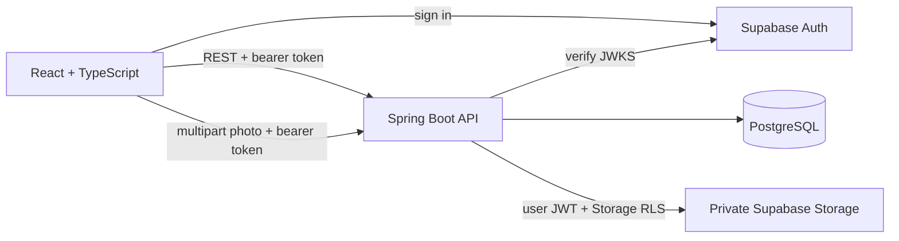
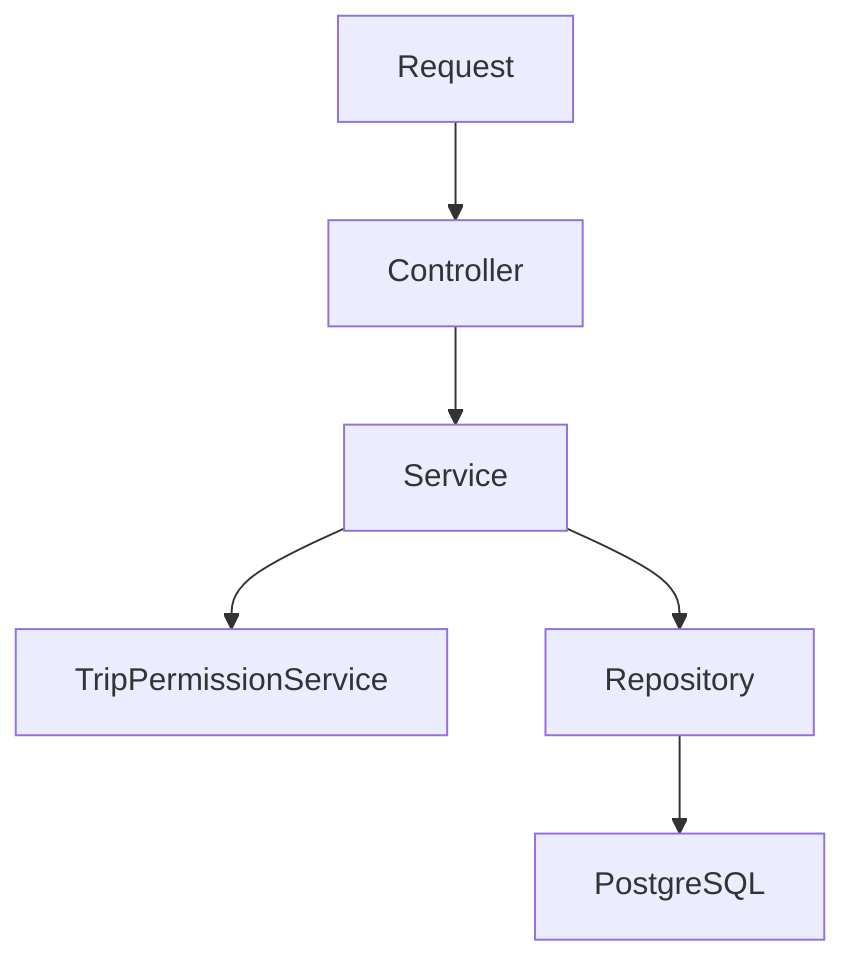

# Architecture

## System boundary

The Spring Boot API is the authoritative layer for permissions, memberships, invitations, expenses, settlements and derived travel intelligence. Hiding a frontend control is never treated as authorization.

## Backend organization

The backend is organized by feature (`trip`, `membership`, `invitation`, `user`, `photo`, and later `expense`), with thin controllers and explicit services. Cross-feature policy is kept in narrowly named services such as `TripPermissionService`.

Entities are not exposed directly through REST. Request and response DTOs define the contract, and a global exception handler produces stable error codes.

## Frontend organization

The frontend groups code around product features. React Router owns navigation, TanStack Query owns server state, the API client attaches the current Supabase access token, and forms validate locally with Zod while the backend repeats authoritative validation.

Demo mode is an adapter behind the same trip and collaboration API boundaries; components do not contain arbitrary fetch calls.

## Phase boundaries

The current slice covers trip and stop lifecycles, timeline and replay, private collaboration, authenticated profiles/statistics, and private photo storage. Owners control trip settings and lifecycle; owners and editors manage itinerary content and upload photos. Photo bytes stay in Supabase Storage while PostgreSQL stores metadata and extracted EXIF time/GPS values. The next Phase 3 slice is shared expenses and settlement calculation, followed by photo-synchronized replay.
