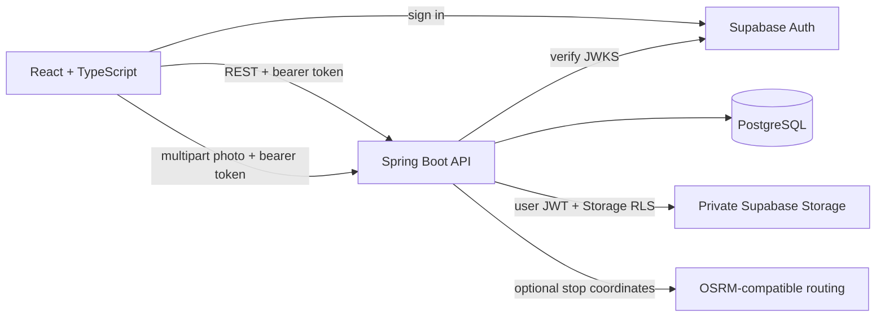
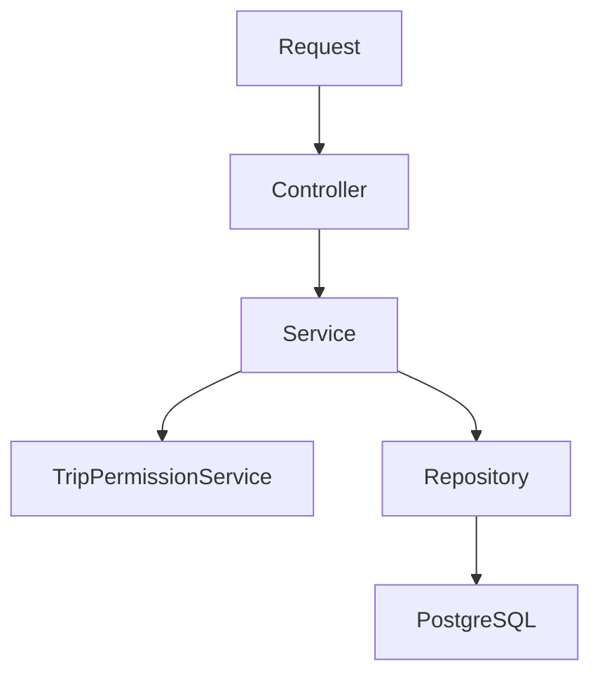

# Architecture

## System boundary

The Spring Boot API is the authoritative layer for permissions, memberships, invitations, expenses, settlements and derived travel intelligence. Hiding a frontend control is never treated as authorization.

## Backend organization

The backend is organized by feature (`trip`, `membership`, `invitation`, `user`, `photo`, `expense`, `rating`, `replay`, `statistics`, `dna`, `worldmap`, `memory`, `comparison` and `publictrip`), with thin controllers and explicit services. Cross-feature policy is kept in narrowly named services such as `TripPermissionService`.

Entities are not exposed directly through REST. Request and response DTOs define the contract, and a global exception handler produces stable error codes.

## Frontend organization

The frontend groups code around product features. React Router owns navigation, TanStack Query owns server state, the API client attaches the current Supabase access token, and forms validate locally with Zod while the backend repeats authoritative validation.

Demo mode is an adapter behind the same trip and collaboration API boundaries; components do not contain arbitrary fetch calls.

## Implemented capability

The implemented vertical slices cover trip and stop lifecycles, road-aware replay, private collaboration, authenticated profiles, private photo storage, shared expenses and settlements, ratings, Travel DNA, statistics, comparisons, the world map, memory views and curated public sharing.

Owners control trip settings, lifecycle, membership roles and invitation revocation. Owners and editors manage itinerary content, expenses and photo uploads; viewers receive read-only access. Photo bytes stay in Supabase Storage while PostgreSQL stores metadata, extracted EXIF time/GPS values and explicit public-visibility choices.

Public sharing has a separate read model and controller. A PUBLIC trip does not grant access to internal member endpoints, and only photos explicitly selected for public visibility can appear on the anonymous page.

Road routing is optional because the configured provider receives saved stop coordinates. When routing is disabled or unavailable, replay returns direct local segments without sending coordinates outside the application boundary.
