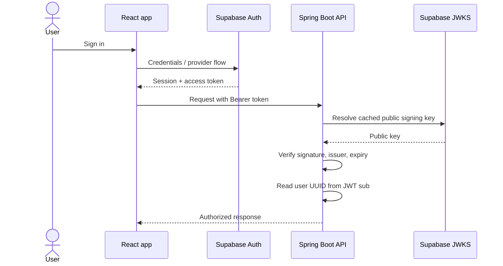

# Authentication flow

The API never accepts a frontend-provided `userId` as identity. `AuthenticatedUserProvider` reads the subject from the verified token, while `UserProfileService` synchronizes non-authoritative display fields such as email and name.

Supabase asymmetric signing keys and the project JWKS endpoint are preferred. Secrets and service-role keys are never exposed through `VITE_` environment variables.
