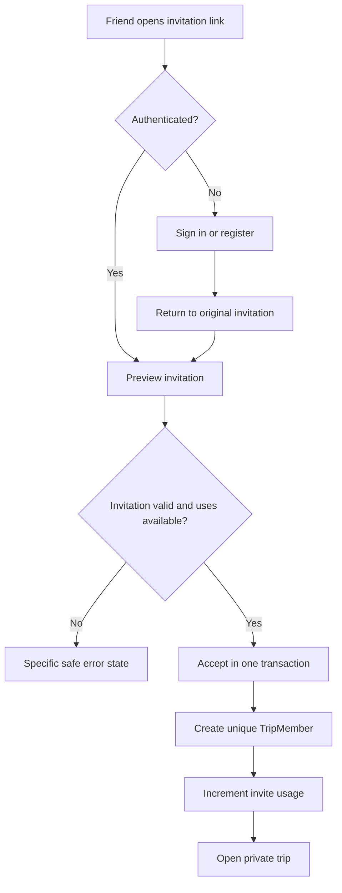

# Trip invitation flow

Only a hash of the high-entropy URL-safe token is stored. Acceptance locks or atomically updates the invite row so concurrent requests cannot exceed `max_uses`. The invite grants membership only after authentication and successful validation; it never changes trip visibility.

The public preview endpoint returns only invitation-safe metadata. Creating, listing and revoking links is owner-only; accepting requires a valid Supabase JWT. The unique membership constraint is the final database guard against duplicate joins.
