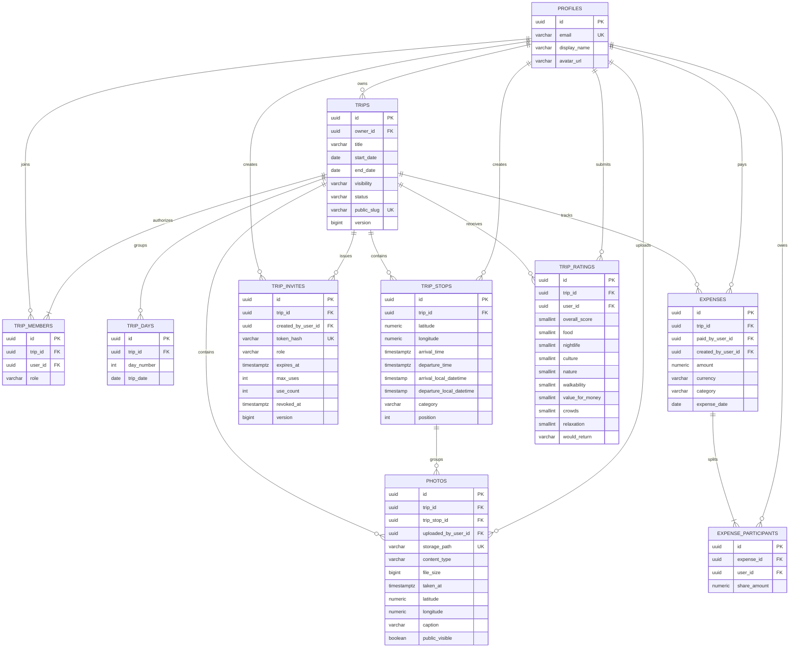

# Database schema

## Current model

Important invariants are enforced twice: friendly validation in Java and hard constraints in PostgreSQL. Examples include `end_date >= start_date`, a single membership per `(trip_id, user_id)`, one owner membership per trip, coordinate ranges, ordered stop positions, invitation roles limited to `EDITOR` / `VIEWER`, positive `max_uses`, `0 <= use_count <= max_uses`, positive expense amounts, ISO-style currency codes, unique expense participants and one rating per `(trip_id, user_id)`.

Invitation rows store a unique SHA-256 hash rather than the raw URL token. A pessimistic row lock during acceptance keeps concurrent requests from crossing the usage limit. Photo rows store metadata only; image bytes live in the private `trip-photos` Storage bucket and are served through short-lived signed URLs.

Application records are accessed through the Spring API. RLS is enabled on all application tables and direct `anon` / `authenticated` table privileges are revoked as defense in depth against accidental Data API exposure. Storage uses narrowly scoped policies and `SECURITY DEFINER` helper functions for member and explicitly public photo access.

The schema is append-only from Flyway's perspective: new versions add or evolve structures without rewriting migrations that may already have run in another environment.
