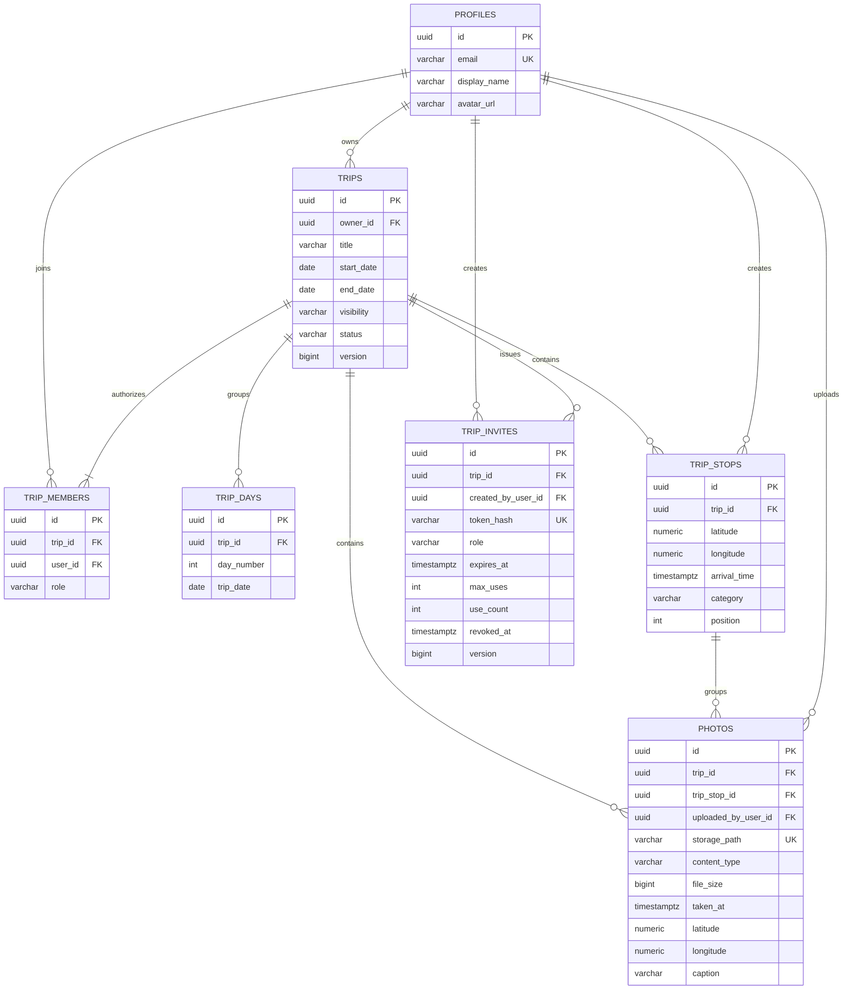

# Database schema

## Current model

Important invariants are enforced twice: friendly validation in Java and hard constraints in PostgreSQL. Examples include `end_date >= start_date`, a single membership per `(trip_id, user_id)`, one owner membership per trip, coordinate ranges, ordered stop positions, invitation roles limited to `EDITOR` / `VIEWER`, positive `max_uses`, and `0 <= use_count <= max_uses`.

Invitation rows store a unique SHA-256 hash rather than the raw URL token. A pessimistic row lock during acceptance keeps concurrent requests from crossing the usage limit. Photo rows store metadata only; image bytes live in the private `trip-photos` Storage bucket and are served through short-lived signed URLs. Future tables (`expenses`, `expense_participants`, `trip_ratings`) are added by new Flyway migrations rather than modifying applied migrations.
